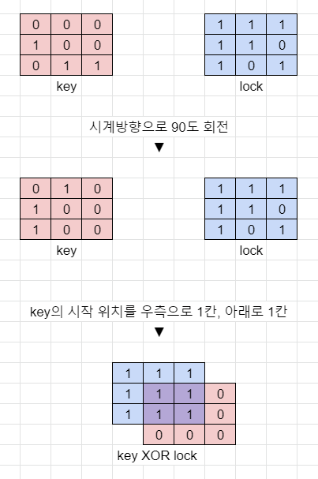

참여인원 4
> 잡부 : https://github.com/lordchiwoo/algo_programmers  
> 강서 : https://github.com/mertyn88/algorithm  
> 가니 : https://github.com/kwan1989/algorithm_Programmers

진행방법
> 프로그래머스나 기타 알고리즘 문제를 각자의 방법으로 해결하고 각자 깃허브에 업로드 함.  
> 이후 디스코드 화면 공유로 문제 해결 과정에 대한 리뷰를 진행 함. 

---
## 기둥과 보 설치 - 2020 KAKAO BLIND RECRUITMENT - 2021.07.26
### 문제 및 풀이
[Programmers](https://programmers.co.kr/learn/courses/30/lessons/60061)  
[Git Solution](https://github.com/JhonverKing/AlgoStudy/blob/main/ColumnsAndBeams/src/Main.java)  

<details markdown="1">
  <summary>내용 보기</summary>

### 문제내용

빙하가 깨지면서 스노우타운에 떠내려 온 "죠르디"는 인생 2막을 위해 주택 건축사업에 뛰어들기로 결심하였습니다.  
"죠르디"는 기둥과 보를 이용하여 벽면 구조물을 자동으로 세우는 로봇을 개발할 계획인데, 그에 앞서 로봇의 동작을 시뮬레이션 할 수 있는 프로그램을 만들고 있습니다.  
프로그램은 2차원 가상 벽면에 기둥과 보를 이용한 구조물을 설치할 수 있는데, 기둥과 보는 길이가 1인 선분으로 표현되며 다음과 같은 규칙을 가지고 있습니다.  
````
 - 기둥은 바닥 위에 있거나 보의 한쪽 끝 부분 위에 있거나, 또는 다른 기둥 위에 있어야 합니다.
 - 보는 한쪽 끝 부분이 기둥 위에 있거나, 또는 양쪽 끝 부분이 다른 보와 동시에 연결되어 있어야 합니다.
 - 단, 바닥은 벽면의 맨 아래 지면을 말합니다.
````
2차원 벽면은 n x n 크기 정사각 격자 형태이며, 각 격자는 1 x 1 크기입니다. 맨 처음 벽면은 비어있는 상태입니다.  
기둥과 보는 격자선의 교차점에 걸치지 않고, 격자 칸의 각 변에 정확히 일치하도록 설치할 수 있습니다.  

다음은 기둥과 보를 설치해 구조물을 만든 예시입니다.  


예를 들어, 위 그림은 다음 순서에 따라 구조물을 만들었습니다.  
````
1. (1, 0)에서 위쪽으로 기둥을 하나 설치 후, (1, 1)에서 오른쪽으로 보를 하나 만듭니다.
2. (2, 1)에서 위쪽으로 기둥을 하나 설치 후, (2, 2)에서 오른쪽으로 보를 하나 만듭니다.
3. (5, 0)에서 위쪽으로 기둥을 하나 설치 후, (5, 1)에서 위쪽으로 기둥을 하나 더 설치합니다.
4. (4, 2)에서 오른쪽으로 보를 설치 후, (3, 2)에서 오른쪽으로 보를 설치합니다.

만약 (4, 2)에서 오른쪽으로 보를 먼저 설치하지 않고, 
(3, 2)에서 오른쪽으로 보를 설치하려 한다면 2번 규칙에 맞지 않으므로 설치가 되지 않습니다. 
기둥과 보를 삭제하는 기능도 있는데 기둥과 보를 삭제한 후에 남은 기둥과 보들 또한 위 규칙을 만족해야 합니다. 
만약, 작업을 수행한 결과가 조건을 만족하지 않는다면 해당 작업은 무시됩니다.
````
벽면의 크기 n, 기둥과 보를 설치하거나 삭제하는 작업이 순서대로 담긴 2차원 배열 build_frame이 매개변수로 주어질 때,  
모든 명령어를 수행한 후 구조물의 상태를 return 하도록 solution 함수를 완성해주세요.  
````
제한사항  
 - n은 5 이상 100 이하인 자연수입니다.  
 - build_frame의 세로(행) 길이는 1 이상 1,000 이하입니다.  
 - build_frame의 가로(열) 길이는 4입니다.  
 - build_frame의 원소는 [x, y, a, b]형태입니다.  
     - x, y는 기둥, 보를 설치 또는 삭제할 교차점의 좌표이며, [가로 좌표, 세로 좌표] 형태입니다.  
     - a는 설치 또는 삭제할 구조물의 종류를 나타내며, 0은 기둥, 1은 보를 나타냅니다.  
     - b는 구조물을 설치할 지, 혹은 삭제할 지를 나타내며 0은 삭제, 1은 설치를 나타냅니다.  
     - 벽면을 벗어나게 기둥, 보를 설치하는 경우는 없습니다.  
     - 바닥에 보를 설치 하는 경우는 없습니다.  
 - 구조물은 교차점 좌표를 기준으로 보는 오른쪽, 기둥은 위쪽 방향으로 설치 또는 삭제합니다.  
 - 구조물이 겹치도록 설치하는 경우와, 없는 구조물을 삭제하는 경우는 입력으로 주어지지 않습니다.  
 - 최종 구조물의 상태는 아래 규칙에 맞춰 return 해주세요.  
     - return 하는 배열은 가로(열) 길이가 3인 2차원 배열로, 각 구조물의 좌표를 담고있어야 합니다.  
     - return 하는 배열의 원소는 [x, y, a] 형식입니다.  
     - x, y는 기둥, 보의 교차점 좌표이며, [가로 좌표, 세로 좌표] 형태입니다.  
     - 기둥, 보는 교차점 좌표를 기준으로 오른쪽, 또는 위쪽 방향으로 설치되어 있음을 나타냅니다.  
     - a는 구조물의 종류를 나타내며, 0은 기둥, 1은 보를 나타냅니다.  
     - return 하는 배열은 x좌표 기준으로 오름차순 정렬하며, x좌표가 같을 경우 y좌표 기준으로 오름차순 정렬해주세요.  
     - x, y좌표가 모두 같은 경우 기둥이 보보다 앞에 오면 됩니다  
````
|n|build_frame|result|  
|---|---|---|  
|5|[[1,0,0,1],[1,1,1,1],[2,1,0,1],[2,2,1,1],[5,0,0,1],[5,1,0,1],[4,2,1,1],[3,2,1,1]]|[[1,0,0],[1,1,1],[2,1,0],[2,2,1],[3,2,1],[4,2,1],[5,0,0],[5,1,0]]|  
|5|[[0,0,0,1],[2,0,0,1],[4,0,0,1],[0,1,1,1],[1,1,1,1],[2,1,1,1],[3,1,1,1],[2,0,0,0],[1,1,1,0],[2,2,0,1]]|[[0,0,0],[0,1,1],[1,1,1],[2,1,1],[3,1,1],[4,0,0]]|  

### 풀이과정
##### 초기구상
1. 기둥 설치 조건과 보 설치 조건 정리
2. 설치시 조건 비교
3. 삭제시 삭제후 남은 프레임들이 유효한지 검사

##### 진행하며 수정된 내용  
 - 

##### 최종형태
1. 

##### 실행결과
    테스트 1 〉	통과 (0.86ms, 52.3MB)
    테스트 2 〉	통과 (0.94ms, 52.4MB)
    테스트 3 〉	통과 (0.86ms, 52.9MB)
    테스트 4 〉	통과 (0.96ms, 52.7MB)
    테스트 5 〉	통과 (1.05ms, 52.7MB)
    테스트 6 〉	통과 (2.90ms, 52.9MB)
    테스트 7 〉	통과 (0.80ms, 52MB)
    테스트 8 〉	통과 (0.80ms, 51.9MB)
    테스트 9 〉	통과 (0.79ms, 52.2MB)
    테스트 10 〉	통과 (51.06ms, 54.5MB)
    테스트 11 〉	통과 (109.47ms, 55.9MB)
    테스트 12 〉	통과 (28.22ms, 54.1MB)
    테스트 13 〉	통과 (143.96ms, 56.4MB)
    테스트 14 〉	통과 (44.59ms, 54.1MB)
    테스트 15 〉	통과 (162.39ms, 56MB)
    테스트 16 〉	통과 (43.50ms, 53.5MB)
    테스트 17 〉	통과 (165.48ms, 58.9MB)
    테스트 18 〉	통과 (307.99ms, 60.9MB)
    테스트 19 〉	통과 (278.03ms, 60.4MB)
    테스트 20 〉	통과 (267.47ms, 61.4MB)
    테스트 21 〉	통과 (255.54ms, 62.5MB)
    테스트 22 〉	통과 (203.67ms, 61.4MB)
    테스트 23 〉	통과 (222.96ms, 62MB)

</details>

## 자물쇠와 열쇠 - 2020 KAKAO BLIND RECRUITMENT - 2021.07.19
### 문제 및 풀이
[Programmers](https://programmers.co.kr/learn/courses/30/lessons/60059)  
[Git Solution](https://github.com/JhonverKing/AlgoStudy/blob/main/LockAndKey/src/Main.java)  

<details markdown="1">
  <summary>내용 보기</summary>

### 문제내용
````
고고학자인 "튜브"는 고대 유적지에서 보물과 유적이 가득할 것으로 추정되는 비밀의 문을 발견하였습니다. 
그런데 문을 열려고 살펴보니 특이한 형태의 자물쇠로 잠겨 있었고 문 앞에는 특이한 형태의 열쇠와 함께 자물쇠를 푸는 방법에 대해 다음과 같이 설명해 주는 종이가 발견되었습니다.

잠겨있는 자물쇠는 격자 한 칸의 크기가 1 x 1인 N x N 크기의 정사각 격자 형태이고 특이한 모양의 열쇠는 M x M 크기인 정사각 격자 형태로 되어 있습니다.

자물쇠에는 홈이 파여 있고 열쇠 또한 홈과 돌기 부분이 있습니다. 
열쇠는 회전과 이동이 가능하며 열쇠의 돌기 부분을 자물쇠의 홈 부분에 딱 맞게 채우면 자물쇠가 열리게 되는 구조입니다. 
자물쇠 영역을 벗어난 부분에 있는 열쇠의 홈과 돌기는 자물쇠를 여는 데 영향을 주지 않지만, 
자물쇠 영역 내에서는 열쇠의 돌기 부분과 자물쇠의 홈 부분이 정확히 일치해야 하며 열쇠의 돌기와 자물쇠의 돌기가 만나서는 안됩니다. 
또한 자물쇠의 모든 홈을 채워 비어있는 곳이 없어야 자물쇠를 열 수 있습니다.

열쇠를 나타내는 2차원 배열 key와 자물쇠를 나타내는 2차원 배열 lock이 매개변수로 주어질 때, 
열쇠로 자물쇠를 열수 있으면 true를, 열 수 없으면 false를 return 하도록 solution 함수를 완성해주세요.

 - key는 M x M(3 ≤ M ≤ 20, M은 자연수)크기 2차원 배열입니다.
 - lock은 N x N(3 ≤ N ≤ 20, N은 자연수)크기 2차원 배열입니다.
 - M은 항상 N 이하입니다.
 - key와 lock의 원소는 0 또는 1로 이루어져 있습니다.
 - 0은 홈 부분, 1은 돌기 부분을 나타냅니다. 
````
|key|lock|result|  
|---|---|---|  
|[[0, 0, 0], [1, 0, 0], [0, 1, 1]]|[[1, 1, 1], [1, 1, 0], [1, 0, 1]]|true|  

### 풀이과정
##### 초기구상
1. 현재 위치에서 90도씩 회전하면서 열쇠가 맞는지 확인.
2. 현재 위치를 1씩 변경시켜서 전체 범위를 탐색 반복
3. 열쇠와 자물쇠가 최소 한칸 이상 겹쳐야함

##### 문제 이해하기  


##### 최종형태
0. 0도, 90도, 180도, 270도 키 회전셋을 미리 만들어둠 - 일일이 새로 회전 배열 만드는것 보다 빠름
1. 현재 위치에서 90도씩 회전하면서 열쇠가 맞는지 확인.  
  1.1 자물쇠의 칸이 열쇠와 겹치는 부분을 ``XOR``  
  1.2 열쇠와 겹치지 않는 부분에 빈곳이 없는지 체크한다.  
2. 현재 위치를 1씩 변경시켜서 전체 범위를 위와 같은 방법으로 탐색 반복
3. 열쇠와 자물쇠가 최소 한칸 이상 겹쳐야함

##### 실행결과
    테스트 1 〉	통과 (0.10ms, 52.9MB)
    테스트 2 〉	통과 (0.04ms, 52.3MB)
    테스트 3 〉	통과 (1.03ms, 52.8MB)
    테스트 4 〉	통과 (0.04ms, 52.5MB)
    테스트 5 〉	통과 (0.08ms, 52.9MB)
    테스트 6 〉	통과 (0.08ms, 52.4MB)
    테스트 7 〉	통과 (3.25ms, 52.8MB)
    테스트 8 〉	통과 (5.34ms, 52MB)
    테스트 9 〉	통과 (0.18ms, 52.3MB)
    테스트 10 〉	통과 (0.36ms, 52.8MB)
    테스트 11 〉	통과 (1.33ms, 52.4MB)
    테스트 12 〉	통과 (0.04ms, 51.8MB)
    테스트 13 〉	통과 (0.21ms, 52.6MB)
    테스트 14 〉	통과 (0.12ms, 52.8MB)
    테스트 15 〉	통과 (1.74ms, 52.4MB)
    테스트 16 〉	통과 (0.97ms, 52.7MB)
    테스트 17 〉	통과 (0.09ms, 52.5MB)
    테스트 18 〉	통과 (2.39ms, 53.1MB)
    테스트 19 〉	통과 (0.06ms, 52.1MB)
    테스트 20 〉	통과 (2.71ms, 51.8MB)
    테스트 21 〉	통과 (0.54ms, 52.2MB)
    테스트 22 〉	통과 (0.22ms, 52.2MB)
    테스트 23 〉	통과 (0.17ms, 53MB)
    테스트 24 〉	통과 (0.23ms, 52.2MB)
    테스트 25 〉	통과 (4.95ms, 52.9MB)
    테스트 26 〉	통과 (2.80ms, 53.2MB)
    테스트 27 〉	통과 (1.68ms, 52.1MB)
    테스트 28 〉	통과 (0.26ms, 52.3MB)
    테스트 29 〉	통과 (0.30ms, 52MB)
    테스트 30 〉	통과 (0.94ms, 52.7MB)
    테스트 31 〉	통과 (1.78ms, 53.7MB)
    테스트 32 〉	통과 (1.05ms, 53.3MB)
    테스트 33 〉	통과 (0.31ms, 52.4MB)
    테스트 34 〉	통과 (0.07ms, 52.6MB)
    테스트 35 〉	통과 (0.13ms, 52.8MB)
    테스트 36 〉	통과 (0.12ms, 52.2MB)
    테스트 37 〉	통과 (0.07ms, 52.8MB)
    테스트 38 〉	통과 (0.04ms, 52.7MB)

</details>

## 조이스틱 - 탐욕법 - 2021.07.16  
### 문제 및 풀이
[Programmers](https://programmers.co.kr/learn/courses/30/lessons/42860)  
[Git Solution](https://github.com/JhonverKing/AlgoStudy/blob/main/Joystick/src/Main.java)  

<details markdown="1">
  <summary>내용 보기</summary>

### 문제내용
````
조이스틱으로 알파벳 이름을 완성하세요. 맨 처음엔 A로만 이루어져 있습니다.
ex) 완성해야 하는 이름이 세 글자면 AAA, 네 글자면 AAAA

조이스틱을 각 방향으로 움직이면 아래와 같습니다.

▲ - 다음 알파벳
▼ - 이전 알파벳 (A에서 아래쪽으로 이동하면 Z로)
◀ - 커서를 왼쪽으로 이동 (첫 번째 위치에서 왼쪽으로 이동하면 마지막 문자에 커서)
▶ - 커서를 오른쪽으로 이동

- 첫 번째 위치에서 조이스틱을 위로 9번 조작하여 J를 완성합니다.
- 조이스틱을 왼쪽으로 1번 조작하여 커서를 마지막 문자 위치로 이동시킵니다.
- 마지막 위치에서 조이스틱을 아래로 1번 조작하여 Z를 완성합니다.
따라서 11번 이동시켜 "JAZ"를 만들 수 있고, 이때가 최소 이동입니다.

만들고자 하는 이름 name이 매개변수로 주어질 때, 이름에 대해 조이스틱 조작 횟수의 최솟값을 return 하도록 solution 함수를 만드세요.

제한 사항
 - name은 알파벳 대문자로만 이루어져 있습니다.
 - name의 길이는 1 이상 20 이하입니다.
````
|name|return|  
|---|---|  
|"JEROEN"|56|
|"JAN"|23|

### 풀이과정
##### 초기구상
1. 첫번째 문자부터 ASCII로 거리 계산하기 (정방향 역방향 중 더 작은값으로 )  
2. 정방향, 역방향으로 다음 검사할 문자를 찾기  
3. 반복~

##### 진행하며 수정된 내용  
 - 

##### 최종형태
1. 첫번째 문자부터 ``ASCII``로 거리 계산하여 누적 (정방향 역방향 중 더 작은값으로 )  
  1.1 정방향 : ``바꿀문자 - 'A'``  
  1.2 역방향 : ``'Z' - 바꿀문자 + 1``  
2. 현재 문자 위치부터 다음으로 바꿀 문자 위치를 찾아 그 위치 까지의 거리를 누적 (정방향 역방향 중 더 작은값으로 )  
  2.1 정방향 : ``(현재위치 + 거리) % length``  
  2.2 역방향 : ``(현재위치 - 거리 + length) % length``  
3. 위 1,2를 반복하여 문자열 length 만큼 돌았으면 누적 결과 반환  

##### 실행결과
    테스트 1 〉	통과 (0.02ms, 52.2MB)
    테스트 2 〉	통과 (0.03ms, 52.1MB)
    테스트 3 〉	통과 (0.04ms, 52MB)
    테스트 4 〉	통과 (0.04ms, 51.9MB)
    테스트 5 〉	통과 (0.03ms, 52.7MB)
    테스트 6 〉	통과 (0.04ms, 52.1MB)
    테스트 7 〉	통과 (0.03ms, 52.2MB)
    테스트 8 〉	통과 (0.02ms, 52.7MB)
    테스트 9 〉	통과 (0.03ms, 52.9MB)
    테스트 10 〉	통과 (0.03ms, 53.7MB)
    테스트 11 〉	통과 (0.05ms, 52.2MB)

</details>

## 입국심사 - 이분탐색 - 2021.07.12  
### 문제 및 풀이
[Programmers](https://programmers.co.kr/learn/courses/30/lessons/43238)  
[Git Solution](https://github.com/JhonverKing/AlgoStudy/blob/main/Immigration/src/Main.java)  

<details markdown="1">
  <summary>내용 보기</summary>

### 문제내용
````
n명이 입국심사를 위해 줄을 서서 기다리고 있습니다. 
각 입국심사대에 있는 심사관마다 심사하는데 걸리는 시간은 다릅니다.

처음에 모든 심사대는 비어있습니다. 
한 심사대에서는 동시에 한 명만 심사를 할 수 있습니다. 
가장 앞에 서 있는 사람은 비어 있는 심사대로 가서 심사를 받을 수 있습니다. 
하지만 더 빨리 끝나는 심사대가 있으면 기다렸다가 그곳으로 가서 심사를 받을 수도 있습니다.

모든 사람이 심사를 받는데 걸리는 시간을 최소로 하고 싶습니다.

입국심사를 기다리는 사람 수 n, 
각 심사관이 한 명을 심사하는데 걸리는 시간이 담긴 배열 times가 매개변수로 주어질 때, 
모든 사람이 심사를 받는데 걸리는 시간의 최솟값을 return 하도록 solution 함수를 작성해주세요.

제한사항
 - 입국심사를 기다리는 사람은 1명 이상 1,000,000,000명 이하입니다.
 - 각 심사관이 한 명을 심사하는데 걸리는 시간은 1분 이상 1,000,000,000분 이하입니다.
 - 심사관은 1명 이상 100,000명 이하입니다.
````
|n|times|return|  
|---|---|---|  
|6|[7, 10]|28|  

### 풀이과정
##### 초기구상
~~times 만큼 배열 생성 (time*입국심사자 만큼 누적할 목적)~~  
~~시간을 1분씩 증가하면서 조건에 따라 찾아서 누적배열에 시간을 누적하면서 n을 1씩 뺌~~  
~~n이 0이 됐을때 max값 찾으면 될듯?~~  

##### 진행하며 수정된 내용  
 - 초기 구상대로 진행하니 타임아웃
 - 시간을 이분탐색으로 찾는 방식으로 변경
 - n을 long으로 변경하고 진행해야함.

##### 최종형태
1. 이분탐색을 위해 먼저 times를 오름차순으로 정렬
2. 이분탐색 진행하며 해당 시간 안에 처리할 수 있는 입국자 수를 구해서 비교하면 됨

##### 실행결과
    테스트 1 〉	통과 (0.48ms, 52.7MB)
    테스트 2 〉	통과 (0.57ms, 53.2MB)
    테스트 3 〉	통과 (2.40ms, 54MB)
    테스트 4 〉	통과 (111.75ms, 59.8MB)
    테스트 5 〉	통과 (115.19ms, 57.9MB)
    테스트 6 〉	통과 (101.07ms, 59.6MB)
    테스트 7 〉	통과 (118.48ms, 59.8MB)
    테스트 8 〉	통과 (135.66ms, 60.2MB)
    테스트 9 〉	통과 (0.49ms, 52.3MB)
</details>

## 순위 - 그래프 - 2021.07.05  
### 문제 및 풀이
[Programmers](https://programmers.co.kr/learn/courses/30/lessons/49191)  
[Git Solution](https://github.com/JhonverKing/AlgoStudy/blob/main/BoxerRank/src/Main.java)  

<details markdown="1">
  <summary>내용 보기</summary>

### 문제내용
````
n명의 권투선수가 권투 대회에 참여했고 각각 1번부터 n번까지 번호를 받았습니다.
권투 경기는 1대1 방식으로 진행이 되고, 만약 A 선수가 B 선수보다 실력이 좋다면 A 선수는 B 선수를 항상 이깁니다.
심판은 주어진 경기 결과를 가지고 선수들의 순위를 매기려 합니다.
하지만 몇몇 경기 결과를 분실하여 정확하게 순위를 매길 수 없습니다.

선수의 수 n, 경기 결과를 담은 2차원 배열 results가 매개변수로 주어질 때
정확하게 순위를 매길 수 있는 선수의 수를 return 하도록 solution 함수를 작성해주세요.

 - 선수의 수는 1명 이상 100명 이하입니다.
 - 경기 결과는 1개 이상 4,500개 이하입니다.
 - results 배열 각 행 [A, B]는 A 선수가 B 선수를 이겼다는 의미입니다.
 - 모든 경기 결과에는 모순이 없습니다.  
````
|n|results|return|  
|---|---|---|  
|5|[[4, 3], [4, 2], [3, 2], [1, 2], [2, 5]]|2|  

### 풀이과정
##### 초기구상
1. 각 노드가 이긴 목록을 담은 HashMap 만들기  
2. 각 노드가 패배한 목록을 담은 HashMap 만들기  
3. 두 HashMap에서 각 노드의 사이즈를 더해서 n-1이면 answer++  

##### 진행하며 수정된 내용  
 - 각 노드가 배배한 목록을 담은 HashMap은 필요가 없어서 빼고함.  
 - 이긴 목록에서 패배한 목록을 찾을 수 있기 때문임.   
 - HashMap에 ArrayList를 담았다가 중복체크하는 부분에서 오래걸려서 실패함  
 - 그래서 ArrayList를 HashSet으로 바꿔서 도전 

##### 최종형태
1. `winnerHashMap` 초기 Key를 생성해둔다 - 나중에 소스안에서 있는지 비교해서 만드는거는 귀찮기때문
2. `dfs`로 해당 노드가 이기는 대상들을 찾아서 winnerHashMap에 넣는다. 이 때 HashSet으로 중복은 허용하지 않는다.
3. 더이상 이기는 대상이 없는 노드는 visited[target] = 1로 방문 완료로 처리해둔다.
4. 노드가 이기는 대상이 방문이 완료된 노드라면 대상을 Key값으로 목록을 불러와서 현재 노드에 값들을 추가해준다.
5. 그렇게 완성된 winnerHashMap에서 각 노드의 사이즈와 각 노드를 가지고 있는 목록을 카운트해서 합한 값을 배열에 저장한다.
6. 배열의 값이 n-1과 같은 노드는 answer++

##### 실행결과 1차) ArrayList를 담은 HashMap - 실패
    테스트 1 〉   통과 (0.11ms, 52.2MB)  
    테스트 2 〉   통과 (0.14ms, 51.9MB)  
    테스트 3 〉   실패 (0.57ms, 52.6MB)  
    테스트 4 〉   실패 (런타임 에러)  
    테스트 5 〉   실패 (50.70ms, 59.9MB)  
    테스트 6 〉   실패 (317.93ms, 125MB)  
    테스트 7 〉   실패 (메모리 초과)  
    테스트 8 〉   실패 (메모리 초과)  
    테스트 9 〉   실패 (메모리 초과)  
    테스트 10 〉   실패 (메모리 초과)  

##### 실행결과 2차) HashSet을 담은 HashMap - 성공
    테스트 1 〉	통과 (8.66ms, 53.2MB)  
    테스트 2 〉	통과 (8.64ms, 52.9MB)  
    테스트 3 〉	통과 (8.58ms, 53.1MB)  
    테스트 4 〉	통과 (9.53ms, 52.9MB)  
    테스트 5 〉	통과 (10.79ms, 52.7MB)  
    테스트 6 〉	통과 (11.87ms, 55.1MB)  
    테스트 7 〉	통과 (30.32ms, 53.9MB)  
    테스트 8 〉	통과 (36.34ms, 58.7MB)  
    테스트 9 〉	통과 (45.96ms, 57.9MB)  
    테스트 10 〉	통과 (44.41ms, 56.2MB)  


</details>


## 가장 먼 노드 - 그래프 - 2021.06.28  
### 문제 및 풀이  
[Programmers](https://programmers.co.kr/learn/courses/30/lessons/49189)  
[Git Solution](https://github.com/JhonverKing/AlgoStudy/blob/main/FarthestNode/src/Main.java)  
<details markdown="1">
  <summary>내용 보기</summary>
  
### 문제내용
````
n개의 노드가 있는 그래프가 있습니다. 각 노드는 1부터 n까지 번호가 적혀있습니다.
1번 노드에서 가장 멀리 떨어진 노드의 갯수를 구하려고 합니다.
가장 멀리 떨어진 노드란 최단경로로 이동했을 때 간선의 개수가 가장 많은 노드들을 의미합니다.
노드의 개수 n, 간선에 대한 정보가 담긴 2차원 배열 vertex가 매개변수로 주어질 때,
1번 노드로부터 가장 멀리 떨어진 노드가 몇 개인지를 return 하도록 solution 함수를 작성해주세요.

 - 노드의 개수 n은 2 이상 20,000 이하입니다.
 - 간선은 양방향이며 총 1개 이상 50,000개 이하의 간선이 있습니다.
 - vertex 배열 각 행 [a, b]는 a번 노드와 b번 노드 사이에 간선이 있다는 의미입니다.
````
|n|vertex|return|
|---|---|---|
|6|[[3, 6], [4, 3], [3, 2], [1, 3], [1, 2], [2, 4], [5, 2]]|3|

### 풀이과정
##### 초기구상
1. bfs로 1번부터 출발해서 갈 수 있는 인접노드를 찾으면서 nextQue를 만들고
2. 현재큐에 nextQue의 값들을 넣고 다시 다음 nextQue를 만든다
3. 더이상 인접한 노드를 찾을 수 없을때 마지막 큐의 사이즈가 정답이다!

##### 진행하며 수정된 내용 
 - 큐 돌리면서 다음 인접노드 리스트를 만드니까 성능문제로 탈락
 - 노드별 인접한 노드 리스트를 담은 ``adjNodeList``를 미리 만들기로 함

##### 최종형태
1. ``adjNodeList`` 인접노드를 미리 담아둠
2. ``bfs`` 구현
3. curQue - 현재 depth에서 방문할 노드 / nextQue - 다음 depth에서 방문할 노드
4. ``visitedEdge[] `` 방문체크
5. 마지막 큐의 사이즈가 정답

##### 실행결과
    테스트 1 〉	통과 (2.76ms, 52.4MB)
    테스트 2 〉	통과 (3.07ms, 52.3MB)
    테스트 3 〉	통과 (6.76ms, 53.2MB)
    테스트 4 〉	통과 (7.21ms, 52.9MB)
    테스트 5 〉	통과 (16.94ms, 54.7MB)
    테스트 6 〉	통과 (14.63ms, 55.5MB)
    테스트 7 〉	통과 (86.35ms, 76.2MB)
    테스트 8 〉	통과 (155.73ms, 78.4MB)
    테스트 9 〉	통과 (123.51ms, 78.2MB)

</details>


## 단어변환 - 깊이/너비 우선 탐색(DFS/BFS) - 2021.06.21  
### 문제 및 풀이  
[Programmers](https://programmers.co.kr/learn/courses/30/lessons/43163)  
[Git Solution](https://github.com/JhonverKing/AlgoStudy/blob/main/WordConversion/src/Main.java)  
<details markdown="1">
  <summary>내용 보기</summary>

### 문제내용
````
두 개의 단어 begin, target과 단어의 집합 words가 있습니다. 
아래와 같은 규칙을 이용하여 begin에서 target으로 변환하는 가장 짧은 변환 과정을 찾으려고 합니다.

    1. 한 번에 한 개의 알파벳만 바꿀 수 있습니다.
    2. words에 있는 단어로만 변환할 수 있습니다.
    예를 들어 begin이 "hit", target가 "cog", words가 ["hot","dot","dog","lot","log","cog"]라면
    "hit" -> "hot" -> "dot" -> "dog" -> "cog"와 같이 4단계를 거쳐 변환할 수 있습니다.

두 개의 단어 begin, target과 단어의 집합 words가 매개변수로 주어질 때,
최소 몇 단계의 과정을 거쳐 begin을 target으로 변환할 수 있는지 return 하도록 solution 함수를 작성해주세요.

 - 각 단어는 알파벳 소문자로만 이루어져 있습니다.
 - 각 단어의 길이는 3 이상 10 이하이며 모든 단어의 길이는 같습니다.
 - words에는 3개 이상 50개 이하의 단어가 있으며 중복되는 단어는 없습니다.
 - begin과 target은 같지 않습니다.
 - 변환할 수 없는 경우에는 0를 return 합니다.
````
|begin|target|words|return|
|---|---|---|---|
|"hit"|"cog"|["hot", "dot", "dog", "lot", "log", "cog"]|4|
|"hit"|"cog"|["hot", "dot", "dog", "lot", "log"]|0|

### 풀이과정
##### 초기구상
1. 단어리스트 반복문 돌면서 현재 단어로부터 바꿀 수 있는 단어인지 찾음
2. 바꿀수 있는 단어 nextQue에 넣음
3. bfs 방식으로 각 단어들의 바꿀수있는 다음 노드 리스트를 생성해서
4. 발견시 depth를 반환하면 정답

##### 진행하며 수정된 내용 
 - bfs, dfs 두가지 방식으로 

##### 최종형태
1. bfs 방식
  1.1. 단어리스트 반복문 돌면서 현재 단어로부터 바꿀 수 있는 단어인지 찾음  
  1.2. 변경 가능한 단어는 방문표시 하고 다음 방문할 큐에 추가  
  1.3. 현재 큐가 비어있을때 다음 방문할 큐가 있다면 방문할 큐를 현재 큐에 넣고 depth를 1 증가한다.  
  1.4. 변경 가능한 단어중 target이 있다면 depth+1을 결과로 리턴  
  1.5. 발견시 depth를 반환하면 정답  
 
2. dfs 방식
  2.1. 방문배열을 노드별로 관리하기 위해 새로운 배열을 생성하여 초기값을 클론으로 할당  
  2.2. 목표 단어와 일치할 경우 노드의 깊이를 반환한다.  
  2.3. 반복 돌면서 변경 가능한 단어는 방문표시 하고 방문(재귀)  
  2.4. 방문한 노드에서 목표단어 까지의 depth를 리턴받아서 가장 작은 값을 result에 담아서 최소값을 유지한다.  

##### 실행결과 - BFS
    테스트 1 〉	통과 (0.16ms, 52.3MB)
    테스트 2 〉	통과 (0.19ms, 53MB)
    테스트 3 〉	통과 (1.24ms, 53.2MB)
    테스트 4 〉	통과 (0.12ms, 52.6MB)
    테스트 5 〉	통과 (0.13ms, 53MB)
    
##### 실행결과 - DFS
    테스트 1 〉	통과 (0.03ms, 52.4MB)
    테스트 2 〉	통과 (0.15ms, 53.3MB)
    테스트 3 〉	통과 (0.92ms, 53.1MB)
    테스트 4 〉	통과 (0.04ms, 52.8MB)
    테스트 5 〉	통과 (0.04ms, 52.7MB)

</details>


## 네트워크 - 깊이/너비 우선 탐색(DFS/BFS) - 2021.06.14  
### 문제 및 풀이
[Programmers](https://programmers.co.kr/learn/courses/30/lessons/43162)  
[Git Solution](https://github.com/JhonverKing/AlgoStudy/blob/main/Network/src/Main.java)  
<details markdown="1">
  <summary>내용 보기</summary>

### 문제내용
````
네트워크란 컴퓨터 상호 간에 정보를 교환할 수 있도록 연결된 형태를 의미합니다. 예를 들어, 컴퓨터 A와 컴퓨터 B가 직접적으로 연결되어있고,
컴퓨터 B와 컴퓨터 C가 직접적으로 연결되어 있을 때 컴퓨터 A와 컴퓨터 C도 간접적으로 연결되어 정보를 교환할 수 있습니다.
따라서 컴퓨터 A, B, C는 모두 같은 네트워크 상에 있다고 할 수 있습니다.
컴퓨터의 개수 n, 연결에 대한 정보가 담긴 2차원 배열 computers가 매개변수로 주어질 때, 네트워크의 개수를 return 하도록 solution 함수를 작성하시오.
        
 - 컴퓨터의 개수 n은 1 이상 200 이하인 자연수입니다.
 - 각 컴퓨터는 0부터 n-1인 정수로 표현합니다.
 - i번 컴퓨터와 j번 컴퓨터가 연결되어 있으면 computers[i][j]를 1로 표현합니다.
 - computer[i][i]는 항상 1입니다.
````
|n|computers|return|
|---|---|---|
|3|[[1, 1, 0], [1, 1, 0], [0, 0, 1]]|2|
|3|[[1, 1, 0], [1, 1, 1], [0, 1, 1]]|1|

### 풀이과정
##### 초기구상
1. bfs로 돌면서 다음 방문할 노드를 찾고
2. 방문체크하고
3. 더이상 방문할곳이 없으면 리턴하고 cnt + 1
4. 이렇게 노드 수만큼 실행하면 될거같다

##### 진행하며 수정된 내용 
 - 처음에는 computers에 값을 2로 수정해서 방문체크를 진행했으나  
   메서드 내부에서 coms[depth][depth] == 2 이렇게 비교하는게 직관적이지 않고  
   computers의 값을 변경했기 때문에 다시 활용할수 없음,  
   computers를 원본으로 유지하려면 결국 2차원 배열에 대한 Deep Copy를 해야함  
 - 방문체크용 visitedArray를 따로 생성해서 사용하기로 함  

##### 최종형태
1. 노드수만큼 반복문 안에서 dfs 메서드 실행  
2. 방문체크하면서 인접노드가 없어지면 1개의 네트워크로 cnt++ 처리  

##### 실행결과
    테스트 1 〉	통과 (0.03ms, 53.3MB)
    테스트 2 〉	통과 (0.02ms, 52.5MB)
    테스트 3 〉	통과 (0.05ms, 52.3MB)
    테스트 4 〉	통과 (0.06ms, 52.1MB)
    테스트 5 〉	통과 (0.02ms, 53MB)
    테스트 6 〉	통과 (0.12ms, 52MB)
    테스트 7 〉	통과 (0.03ms, 52.3MB)
    테스트 8 〉	통과 (0.10ms, 52.6MB)
    테스트 9 〉	통과 (0.06ms, 53.7MB)
    테스트 10 〉	통과 (0.06ms, 52.9MB)
    테스트 11 〉	통과 (0.35ms, 53.4MB)
    테스트 12 〉	통과 (0.27ms, 53.1MB)
    테스트 13 〉	통과 (0.24ms, 53.1MB)

</details>


## 타겟넘버 - 깊이/너비 우선 탐색(DFS/BFS) - 2021.06.07  
### 문제 및 풀이
[Programmers](https://programmers.co.kr/learn/courses/30/lessons/43165)  
[Git Solution](https://github.com/JhonverKing/AlgoStudy/blob/main/TargetNumber/src/Main.java)  
<details markdown="1">
  <summary>내용 보기</summary>

### 문제내용
````
n개의 음이 아닌 정수가 있습니다. 이 수를 적절히 더하거나 빼서 타겟 넘버를 만들려고 합니다.
예를 들어 [1, 1, 1, 1, 1]로 숫자 3을 만들려면 다음 다섯 방법을 쓸 수 있습니다.

    -1+1+1+1+1 = 3
    +1-1+1+1+1 = 3
    +1+1-1+1+1 = 3
    +1+1+1-1+1 = 3
    +1+1+1+1-1 = 3
    
사용할 수 있는 숫자가 담긴 배열 numbers, 타겟 넘버 target이 매개변수로 주어질 때
숫자를 적절히 더하고 빼서 타겟 넘버를 만드는 방법의 수를 return 하도록 solution 함수를 작성해주세요.

 - 주어지는 숫자의 개수는 2개 이상 20개 이하입니다.
 - 각 숫자는 1 이상 50 이하인 자연수입니다.
 - 타겟 넘버는 1 이상 1000 이하인 자연수입니다.
````
|numbers|target|return|
|---|---|---|
|[1, 1, 1, 1, 1]|3|5|

### 풀이과정
##### 초기구상
1. 이 문제는 스스로 풀지않고 정답을 봄

##### 최종형태
1. 재귀 안에서 플러스의 경우와 마이너스의 경우를 모두 실행하여 sum을 구함
2. depth가 주어진 숫자의 수와 같아지면
3. sum이 target과 같은지 비교하여 맞으면 1을 리턴함
4. 각 재귀의 모든 리턴을 더하면 정답 알 수 있음.  

##### 실행결과
    테스트 1 〉	통과 (15.82ms, 31.8MB)
    테스트 2 〉	통과 (14.93ms, 31.7MB)
    테스트 3 〉	통과 (0.33ms, 30.2MB)
    테스트 4 〉	통과 (0.88ms, 30MB)
    테스트 5 〉	통과 (2.96ms, 32MB)
    테스트 6 〉	통과 (0.58ms, 30.1MB)
    테스트 7 〉	통과 (0.33ms, 30.1MB)
    테스트 8 〉	통과 (2.45ms, 32MB)
    
</details>


## 포맷
### 문제 및 풀이
[Programmers]()  
[Git Solution]()  

<details markdown="1">
  <summary>내용 보기</summary>

### 문제내용
````

````
|n|results|return|  
|---|---|---|  
|5|[[4, 3], [4, 2], [3, 2], [1, 2], [2, 5]]|2|  

### 풀이과정
##### 초기구상
1.

##### 진행하며 수정된 내용  
 - 

##### 최종형태
1. 

##### 실행결과
    테스트 1 〉   통과 (0.11ms, 52.2MB)  

</details>

